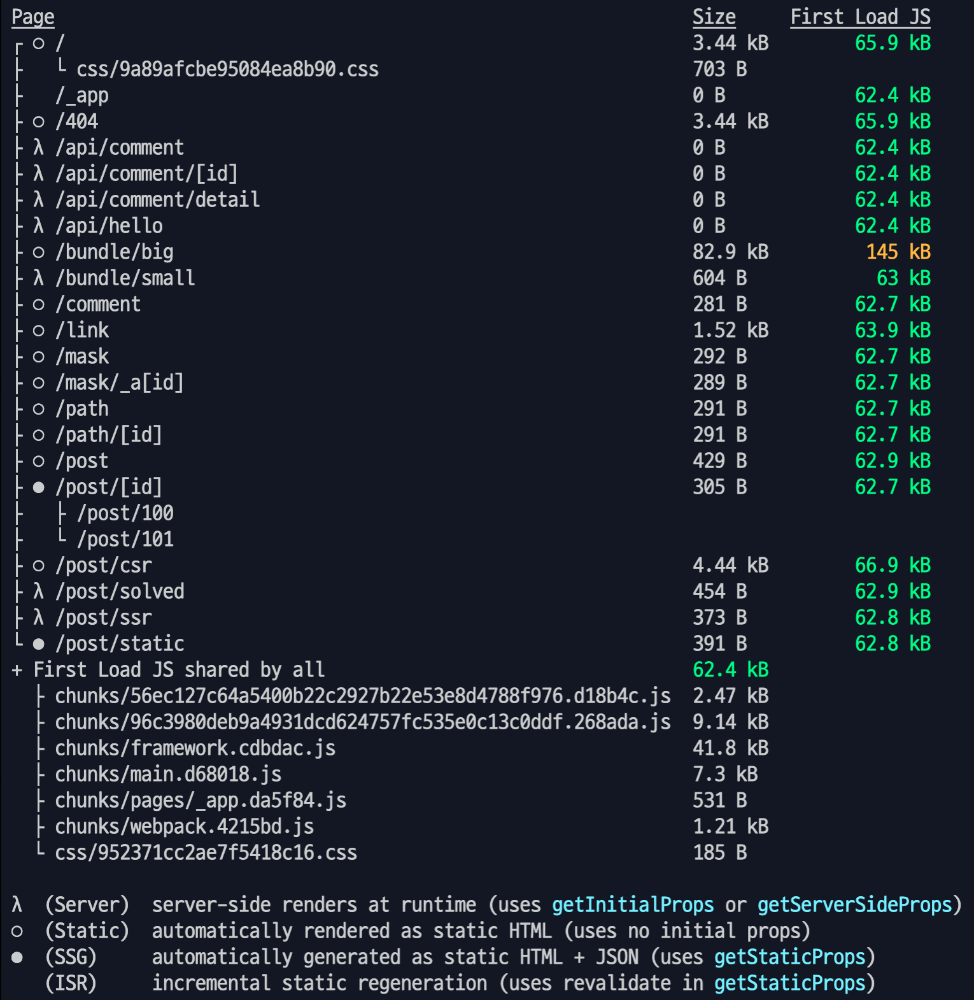

# Next.js 의 라우팅 알아보기

TL;DR!
1. 정적 라우팅 vs 동적 라우팅(with Link tag)
2. 서버모드 vs 클라이언트모드
3. `getInitialProps`, `getStaticPaths`, `getStaticProps`, `getServerSideProps` 각각의 개념 및 차이 알아보기

## 1. 정적 라우팅 vs 동적 라우팅(with Link tag)


기본적으로 Next.js 는 `pages` 디렉토리 하위를 기준으로 **주소 매핑**을 해준다.

따라서 `localhost:3000/path`, `localhost:3000/path/:id` 모두 주소 매핑이 된다.

이를 기반으로 정적 라우팅과 동적 라우팅을 구분해 처리할 수 있다.

```javascript
<Link href={`/path`}>정적 path 이동</Link>
<Link href="/path/[id]" as={`/path/${id}`>동적 path 이동</Link>
```

**[Next.js 10버전](https://nextjs.org/blog/next-10#automatic-resolving-of-href)부터 as 를 통한 다이나믹 링크가 href 에도 사용될 수 있도록 변경되었다.**

```javascript
<Link href={`/path/${id}`}>동적 path 이동</Link>
```

이때 동적 라우팅의 파라미터나 URL을 숨기고 싶다면 `as` 를 사용하면 된다.

```javascript
<Link href={`/mask?id=${id}`} as={`/mask/${id}`}>Dynamic Mask link</Link>
```

이 경우 새로고침을 하게 될시 제대로 된 값을 받을 수 없으므로 `Custom server` 를 만들어 주어야 한다.

> ["커스텀 서버는 서버리스 기능 및 자동 정적 최적화 와 같은 중요한 성능 최적화를 제거한다"](https://nextjs.org/docs/advanced-features/custom-server)

## 2. 서버모드 vs 클라이언트모드

```javascript
// getInitialProps 는 클라이언트, 서버사이드 모두 실행 된다.
Post.getInitialProps = ({ query }) => {
	if (typeof window === 'undefined') {
		console.log('server mode');
	} else {
		console.log('client mode');
  }
  ...
};
```

이후 알아볼 `getInitialProps` 의 예를 보자면, URL 을 통해 서버에 요청을 날리게 될 경우 `Server mode`로 동작해 브라우저에 `server mode` 로그가 찍히며 `Link` 태그를 통해 `Client mode`로 접근할 경우 `client mode` 로그가 찍힌다.

즉 해당 `js` 파일을 '서버'에서 처리하는지 '클라이언트'에서 처리하는지에 따라 모드가 달라진다.

## 3. `getInitialProps`, `getStaticPaths`, `getStaticProps`, `getServerSideProps` 각각의 개념 및 차이 알아보기

- `getInitialProps`: `getStaticPaths`, `getStaticProps`, `getServerSideProps` 를 합친 것과 같다.(v9.3에서 세분화 되면서 더 이상 사용을 [추천하지 않음](https://nextjs.org/docs/api-reference/data-fetching/getInitialProps))
- `getStaticPaths`: pre-render할 동적 라우팅을 선언(getStaticProps와 함께 쓰임)
- `getStaticProps`: 빌드 타임 때 딱 한 번만 실행되며 외부 데이터(fetch)를 JSON 으로 만들어 준다.(빌드 이후 변경 불가)
- `getServerSideProps`: 각각의 요청마다 데이터를 fetch한다(같은 페이지에서 fetch 하고 다른 내용은 렌더함. Static이 아니기 때문에 매 요청마다 데이터를 서버로 부터 가져옴)

`getStaticProps`와 `getServerSideProps`의 차이는 빌드이후에도 data 변경 가능 여부이다.

-> SSG(Static Generation) vs SSR(Server-side rendering)

배포되는 파일이 static, SSR, SSG 중 어디에 속하는지 알고 싶다면 build 결과를 보면 된다.

